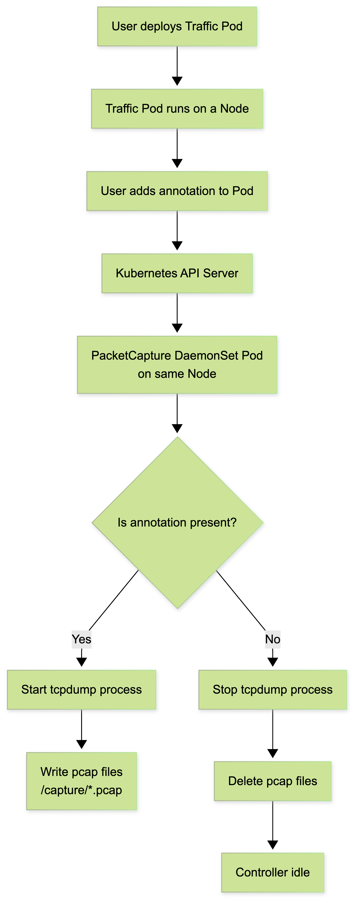
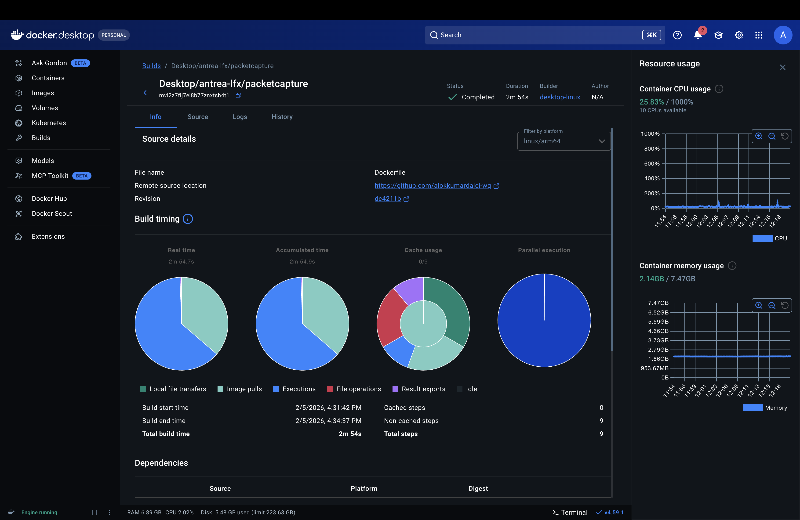
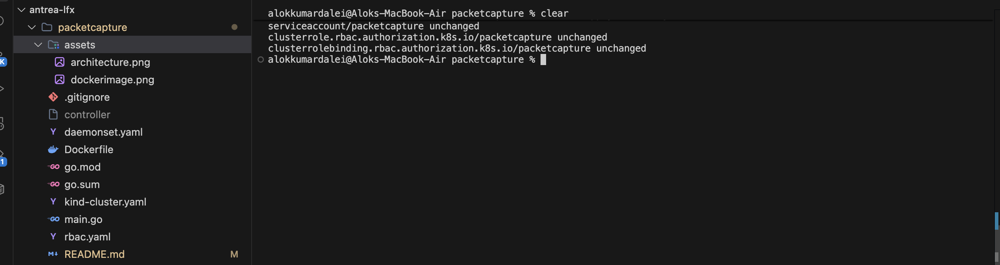
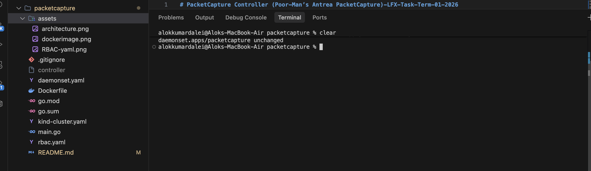
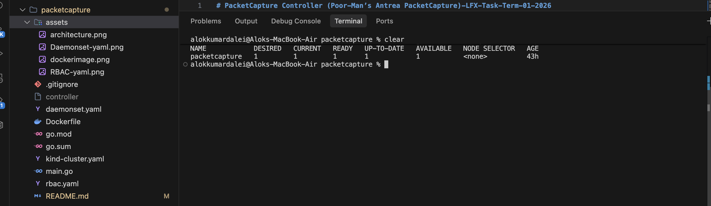
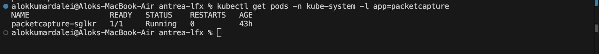
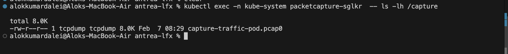

# PacketCapture Controller - LFX Mentorship 2026_01 Test Task #7743

This project implements a simplified version of **Antrea PacketCapture** as part of the LFX evaluation task.  
It demonstrates Kubernetes controller fundamentals, DaemonSets, Pod annotations, and node-level packet capture using `tcpdump`.

---

##  Problem Statement

The goal is to build a Kubernetes controller that:

- Runs as a **DaemonSet** (one Pod per node)
- Watches Pods running on the same node
- Starts packet capture when a specific **annotation** is added to a Pod
- Stops packet capture and cleans up files when the annotation is removed

---

##  Key Idea (In Simple Terms)

- Pods can be annotated with extra metadata
- When a Pod gets annotated with `tcpdump.antrea.io: "<N>"`
- The controller running on the **same node** starts `tcpdump`
- Captured packets are saved as `.pcap` files
- Removing the annotation stops capture and deletes files

---

##  Architecture



### Components

- **Kind Cluster** – local Kubernetes cluster
- **Antrea CNI** – networking layer
- **PacketCapture DaemonSet**
  - Runs on every node
  - Contains a Go controller + tcpdump
- **Application Pod**
  - Generates network traffic
  - Annotated to trigger capture

---

##  Control Flow

1. User adds annotation to a Pod  
2. Controller detects the annotation via Pod watch  
3. Controller starts tcpdump on that node  
4. tcpdump writes rotating `.pcap` files  
5. Annotation is removed  
6. Controller stops tcpdump and deletes files  

---

## Directory Structure
```
packetcapture/
├── kind-cluster.yaml # Kind cluster configuration
├── main.go # Go-based controller
├── Dockerfile # Container image definition
├── daemonset.yaml # DaemonSet manifest
├── rbac.yaml # RBAC permissions
├── architecture.png # Architecture diagram
└── assets/ # Verification screenshots

    
```

##  Prerequisites

- [Kind](https://kind.sigs.k8s.io/docs/user/quick-start/)
- [Antrea](https://antrea.io/docs/2025.1/installation/)
- [kubectl](https://kubernetes.io/docs/tasks/tools/)
- [Go](https://golang.org/dl/)
- [Docker](https://www.docker.com/products/docker-desktop)
- [Helm](https://helm.sh/docs/intro/install/)


##  How to set up/Installation
1.Creating kind cluster:
Run this command on your terminal to create a kind cluster:
```bash
$ kind create cluster --config kind-cluster.yaml
```

2.Installing Antrea CNI:
Run this command on your terminal to install Antrea CNI:
```bash
$ helm repo add antrea https://charts.antrea.io
$ helm repo update
$ helm install antrea antrea/antrea -n kube-system
```

Verify Antrea installation:
```bash
$ kubectl get pods -n kube-system | grep antrea
```

3.Building and Pushing Docker Image:
Run this command on your terminal to build and push the Docker image:
```bash
$ docker build -t packetcapture:latest .
$ docker push packetcapture:latest
```

Verify Docker Image:
```bash
$ kubectl get images | grep packetcapture
```



Successfully created and pushed docker image using Dockerfile through Docker Desktop


4.Deploying the Controller:
Run this command on your terminal to deploy the controller:
```bash
$ kubectl apply -f rbac.yaml // #Apply rbac permissions
```

This shows RBAC permissions applied successfully for the controller.

```bash
$ kubectl apply -f daemonset.yaml // #Deploy the controller as a DaemonSet
```

This shows the controller deployed successfully as a DaemonSet.

Verify Deployement:
Run these commands on your terminal to verify deployment:
```bash
$ kubectl get ds -n kube-system packetcapture
```
After running this command you will see this:

You can see packetcapture Daemonset is in ready state of 1, this shows the Daemonset pod is deployed successfully.

```bash
$ kubectl get pods -n kube-system -l app=packetcapture
```

After running this command you will see this:


This shows your pod with pod_name-xxxx here it is packetcapture-sglkr which is running state of 1 which means your pod created sucessfully and its working.

# Now let's check for tcpduump start and stop functions:

## Start tcpdump:

First let's create a pod and add annotation to it:
```bash
$ kubectl annotate pod traffic-pod tcpdump.antrea.io="3"
```


After running this command your conatroller detects the annotation and starts tcpdump for the pod automatically capture it in  format of .pcap files

You will something like this:



Here you can see that tcpdump is started and it is capturing packets for the pod traffic-pod

## Stop tcpdump:
```bash
 $ kubectl annotate pod traffic-pod tcpdump.antrea.io-
```
 
 This above command stops tcpdump and delete all files in .pcap  format directory.
```bash
 $ kubectl exec -n kube-system packetcapture-sglkr -- ls /capture
```

After running this command you will see there is nothing because tcpdump is stopped and all files are deleted.


# Demo (Verification Only) Video:


The video demonstrates:
- Creating a pod
- Adding annotation to trigger tcpdump
- Capturing packets in .pcap format
- Stopping tcpdump and cleanup

 
 ## Now You have gone through the whole process of creating a pod, adding annotation to it, and then starting and stopping tcpdump for that pod and also verify the working of the controller. 

 ## Now let's clean up the cluster (optiona)
```bash
kubectl delete -f rbac.yaml
kubectl delete -f daemonset.yaml 
kind delete cluster
```
